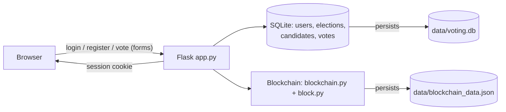

# Blockchain-Based Voting System — Full Site (Admin + Voter, SQLite, Real Auth)

A complete, multi-page website: real login for voters and a separate
admin login, an election lifecycle (create → add candidates → start →
end), and a blockchain ledger underneath it all. Unlike a single-page
app with tabs, **every page here is a real URL protected on the server**
— visiting `/dashboard`, `/blockchain`, `/admin/dashboard`, etc. directly
with no session redirects you to a login page. There is nothing to
"unlock" in the browser; the server itself refuses the page.

## Quick start

```bash
python3 -m venv venv
source venv/bin/activate        # Windows: venv\Scripts\activate
pip install -r requirements.txt
python3 app.py
```

Open **http://127.0.0.1:5000** — you will land on the voter login page.

**Default admin login** (change this before using the project beyond a
class demo — see `database/db.py`):
```
Admin ID: admin
Password: admin123
```

## First-time walkthrough

1. Go to `/admin` (or click "Admin" from the login page) and log in with
   the credentials above.
2. **Create an election** — give it a name.
3. **Add at least two candidates** (you can't start an election with fewer).
4. Click **Start election**.
5. Open a different browser / incognito window (or log out) and
   **register** as a voter, then **log in**.
6. The voter's dashboard now shows the live election — select a
   candidate and **cast your vote**. Try voting again: it's rejected.
7. Check **Results** (tallied live from the chain) and **Ledger** (every
   mined block).
8. Back as admin, open the Ledger — you'll see an extra **"Demo only"**
   box on each vote's block letting you change who it counted for
   *without re-mining*. Apply it, then hit **Verify the ledger** and
   watch it correctly report which block was tampered with.

## Why access control is "real" here

Every voter-only route (`/dashboard`, `/vote`, `/results`, `/blockchain`)
is wrapped in a `@login_required` decorator that checks `session["user_id"]`
**on the server** and redirects to `/login` if it's missing. Every
admin-only route (`/admin/...`) is wrapped in `@admin_required`, checking
`session["is_admin"]`. This is enforced in `app.py`, not in the templates
or in JavaScript — so there's no way to reach a protected page by editing
the URL, disabling JS, or inspecting the page source. That's the
difference between this and a tab-based single-page app, where "hidden"
content is still sitting in the page's HTML/JS.

## Architecture



**Two separate stores, on purpose:**
- **SQLite (`data/voting.db`)** holds relational data: who is registered,
  what elections/candidates exist, and — critically — only *that* a user
  voted in a given election (a `votes` table with just `user_id,
  election_id`), never *for whom*.
- **The blockchain (`data/blockchain_data.json`)** holds the actual vote
  transactions: `{tx_id, voter_hash, candidate_id, election_id}`, one per
  mined block. `voter_hash` is `SHA-256(student_id)` — a one-way hash, not
  the ID itself.

Neither store alone reveals who voted for whom. The application can
answer "did this person vote?" from SQLite, and "who won?" from the
chain, without either table containing both facts at once.

## Project structure

```
blockchain_voting_site/
├── app.py                     # Flask app: routes, auth, session logic
├── blockchain/
│   ├── block.py                # Block: hashing, serialization
│   └── blockchain.py           # Blockchain: mining, persistence, verify, tamper (demo)
├── database/
│   └── db.py                    # SQLite schema + connection helper, seeds default admin
├── templates/                   # Jinja2 pages (base.html + one per route)
├── static/css/style.css
├── data/                        # created at runtime: voting.db, blockchain_data.json
└── requirements.txt
```

## Roles & what each can do

| | Voter | Admin |
|---|---|---|
| Register / log in | ✅ (own account) | ✅ (separate login, seeded by default) |
| See the active election & vote | ✅ | — (admins don't vote) |
| View results | ✅ | ✅ |
| View the ledger, run integrity check | ✅ | ✅ |
| Create/start/end elections, manage candidates | — | ✅ |
| View the registered-voter list | — | ✅ |
| Tamper demo (edit a vote without re-mining) | — | ✅ (clearly labeled "demo only") |

## Election rules enforced

- A new election can't be created while one is still `pending` or `active`.
- Candidates can only be added/removed while an election is `pending`.
- An election needs **at least two candidates** before it can be started.
- A voter can cast **exactly one** vote per election — checked against
  the SQLite `votes` table *and*, independently, by re-scanning the
  blockchain for that voter's hash (defense in depth: even if the SQLite
  row were somehow missing, the chain itself would still catch it).

## What was tested before delivery

Every flow below was run end-to-end with `curl` (simulating real browser
sessions via cookies) before this was packaged:
- Unauthenticated requests to `/dashboard`, `/admin/dashboard`, and
  `/blockchain` all correctly redirect to a login page (302).
- Voter registration and login; a second independent voter account.
- Admin login; election creation; starting an election blocked until two
  candidates exist; adding candidates; starting the election.
- Both voters successfully voting for different candidates.
- A repeat vote attempt from the same voter correctly rejected.
- Results page tallying 1–1 (50%/50%) directly from the chain.
- Ledger showing all mined blocks (genesis + one per vote).
- Integrity check reporting valid on the untouched chain.
- The tamper-demo box appearing only for the admin session, not the
  voter session.
- After tampering, the integrity check correctly identifying the exact
  tampered block.

## Tech stack

- **Backend:** Python 3, Flask (routing, sessions, Jinja2 templates)
- **Auth:** Flask sessions + Werkzeug's `generate_password_hash` /
  `check_password_hash` (salted password hashing)
- **Database:** SQLite via the standard-library `sqlite3` module
- **Blockchain:** custom, from-scratch (`hashlib` SHA-256 + light
  proof-of-work), no external blockchain network or smart-contract platform
- **Frontend:** server-rendered HTML (Jinja2) + hand-written CSS; no
  client-side framework, no client-side cryptography

## Changing things

- **Candidates / elections:** managed entirely through the Admin UI now
  — no code edits needed for a normal run.
- **Default admin credentials:** edit `DEFAULT_ADMIN_STUDENT_ID` /
  `DEFAULT_ADMIN_PASSWORD` in `database/db.py` (only takes effect on a
  fresh `data/voting.db` — delete that file to reseed).
- **Proof-of-work difficulty:** `DIFFICULTY` at the top of
  `blockchain/blockchain.py`.
- **Reset everything:** stop the server and delete `data/voting.db` and
  `data/blockchain_data.json`; they're recreated fresh on next run.
